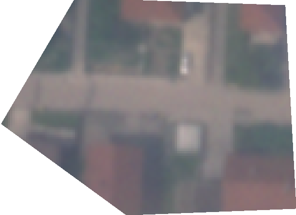

# True color product, PlanetScope

<a href="#" id='togglescript'>Show</a> script or [download](script.js){:target="_blank"} it.


      


## Evaluate and visualize

As SkySat is commercial data, brought into Sentinel Hub as Bring Your Own Data, direct EO Browser and Sentinel Playground links are not possible due to the personalized data credentials.   

## General description

The true color product combines Skysat band values Red, Blue, and Green to create a true color image.

## Description of representative images

A small example with true color visualization.

## References
 - Wikipedia, [True color](https://en.wikipedia.org/wiki/False_color#True_color). Accessed October 10th 2017.
