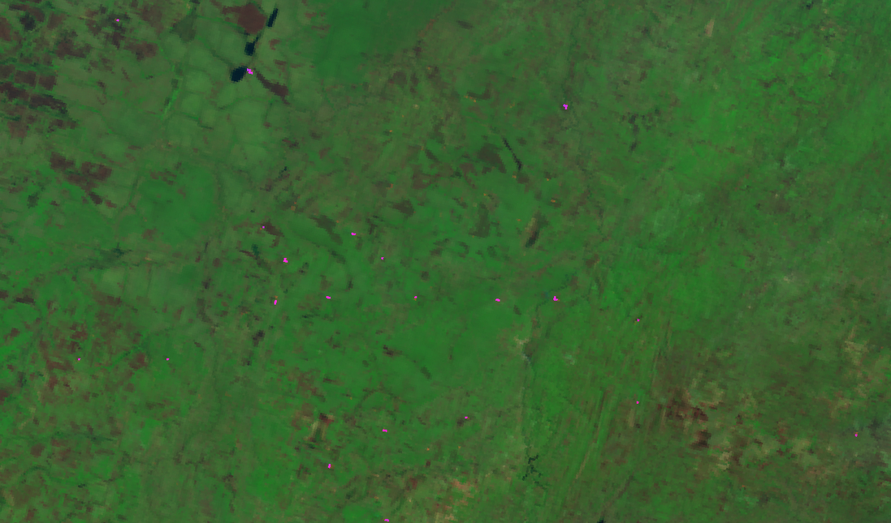
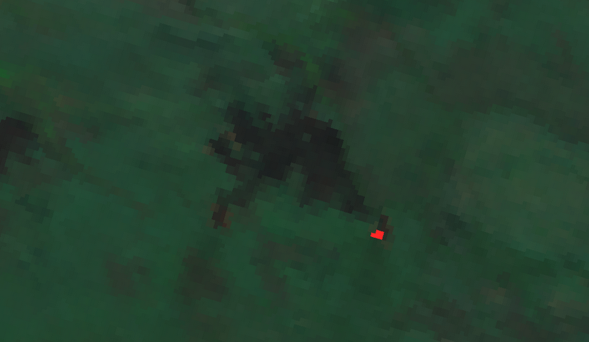

# High Accuracy Active Fire Point Detection 

<a href="#" id='togglescript'>Show</a> script or [download](script.js){:target="_blank"} it.


      


## Evaluate and visualize

 - [EO Browser](https://apps.sentinel-hub.com/eo-browser/?zoom=10&lat=37.66916&lng=-119.7551&themeId=WILDFIRES-NORMAL-MODE&datasetId=S3SLSTR&fromTime=2018-08-06T00%3A00%3A00.000Z&toTime=2018-08-06T23%3A59%3A59.999Z&visualizationUrl=https%3A%2F%2Fservices.sentinel-hub.com%2Fogc%2Fwms%2F616409b9-173e-4012-a580-c0ef4799bc36&evalscript=Ly8gaGlnaCBhY2N1cmFjeSBEZXRlY3QgYWN0aXZlIGZpcmUgcG9pbnRzIAovL1NlbnRpbmVsLTMgU0xTVFIKLy9ieSBUaXpuZ2VyIHN0YXJ0dXAgY28KLy93d3cudGl6bmVnYXIuY29tCgp2YXIgU0FITT0gKChTNiAtIFM1KSAvIChTNiArIFM1KSk7CgppZihTQUhNPi4wNSAmJiBTMTwuMjMpewogIHJldHVybls1KlMzLCAxKlMyLCAxKlMxXQp9CgplbHNlIHsKIHJldHVybiBbUzYsUzMsUzJdCn0KCi8vUmVkIGNvbG9yIGluZGljYXRlcyBhY3RpdmUgZmlyZSBhcmVhcyBhbmQgcG9pbnRz#custom-script){:target="_blank"}

## General description

The script for Sentinel-3 SLSTR identifies active fire points, offering valuable information for monitoring fire spots in any area. 

The Active fire detection script is also available for [Sentinel-2](https://custom-scripts.sentinel-hub.com/sentinel-2/active_fire_detection/). 

## Author of the script

 - [TIZNEGAR Startup co](http://tiznegar.com/)

## Description of representative images

[California wildfires, 2018](https://apps.sentinel-hub.com/eo-browser/?zoom=10&lat=37.66916&lng=-119.7551&themeId=WILDFIRES-NORMAL-MODE&datasetId=S3SLSTR&fromTime=2018-08-06T00%3A00%3A00.000Z&toTime=2018-08-06T23%3A59%3A59.999Z&visualizationUrl=https%3A%2F%2Fservices.sentinel-hub.com%2Fogc%2Fwms%2F616409b9-173e-4012-a580-c0ef4799bc36&evalscript=Ly8gaGlnaCBhY2N1cmFjeSBEZXRlY3QgYWN0aXZlIGZpcmUgcG9pbnRzIAovL1NlbnRpbmVsLTMgU0xTVFIKLy9ieSBUaXpuZ2VyIHN0YXJ0dXAgY28KLy93d3cudGl6bmVnYXIuY29tCgp2YXIgU0FITT0gKChTNiAtIFM1KSAvIChTNiArIFM1KSk7CgppZihTQUhNPi4wNSAmJiBTMTwuMjMpewogIHJldHVybls1KlMzLCAxKlMyLCAxKlMxXQp9CgplbHNlIHsKIHJldHVybiBbUzYsUzMsUzJdCn0KCi8vUmVkIGNvbG9yIGluZGljYXRlcyBhY3RpdmUgZmlyZSBhcmVhcyBhbmQgcG9pbnRz#custom-script), acquired on August 6, 2018, processed by Sentinel Hub.

[Democratic Republic of Congo wildfires, 2020](https://apps.sentinel-hub.com/eo-browser/?zoom=11&lat=-10.03806&lng=24.82361&themeId=DEFAULT-THEME&datasetId=S3SLSTR&fromTime=2020-08-23T00%3A00%3A00.000Z&toTime=2020-08-23T23%3A59%3A59.999Z&visualizationUrl=https%3A%2F%2Fservices.sentinel-hub.com%2Fogc%2Fwms%2F786d8259-f04e-41cb-92fa-42f66a890ff9&evalscript=Ly8gaGlnaCBhY2N1cmFjeSBEZXRlY3QgYWN0aXZlIGZpcmUgcG9pbnRzIAovL1NlbnRpbmVsLTMgU0xTVFIKLy9ieSBUaXpuZ2VyIHN0YXJ0dXAgY28KLy93d3cudGl6bmVnYXIuY29tCgp2YXIgU0FITT0gKChTNiAtIFM1KSAvIChTNiArIFM1KSk7CgppZihTQUhNPi4wNSAmJiBTMTwuMjMpewogIHJldHVybls1KlMzLCAyKlMyLCA4KlMxXQp9CgplbHNlIHsKIHJldHVybiBbMi41KlM2LDIqUzMsMipTMl0KfQoKLy9SZWQgY29sb3IgaW5kaWNhdGVzIGFjdGl2ZSBmaXJlIGFyZWFzIGFuZCBwb2ludHM%3D#custom-script), acquired on August 23, 2020, processed by Sentinel Hub.

[Australia wildfires, 2019](https://apps.sentinel-hub.com/eo-browser/?zoom=11&lat=-21.90514&lng=116.75789&themeId=WILDFIRES-NORMAL-MODE&datasetId=S3SLSTR&fromTime=2019-01-05T00%3A00%3A00.000Z&toTime=2019-01-05T23%3A59%3A59.999Z&visualizationUrl=https%3A%2F%2Fservices.sentinel-hub.com%2Fogc%2Fwms%2F616409b9-173e-4012-a580-c0ef4799bc36&evalscript=Ly8gaGlnaCBhY2N1cmFjeSBEZXRlY3QgYWN0aXZlIGZpcmUgcG9pbnRzIAovL1NlbnRpbmVsLTMgU0xTVFIKLy9ieSBUaXpuZ2VyIHN0YXJ0dXAgY28KLy93d3cudGl6bmVnYXIuY29tCgp2YXIgU0FITT0gKChTNiAtIFM1KSAvIChTNiArIFM1KSk7CgppZihTQUhNPi4wNSAmJiBTMTwuMjMpewogIHJldHVybls1KlMzLCAxKlMyLCAxKlMxXQp9CgplbHNlIHsKIHJldHVybiBbUzYsUzMsUzJdCn0KCi8vUmVkIGNvbG9yIGluZGljYXRlcyBhY3RpdmUgZmlyZSBhcmVhcyBhbmQgcG9pbnRz#custom-script), acquired on January 5, 2019, processed by Sentinel Hub.

