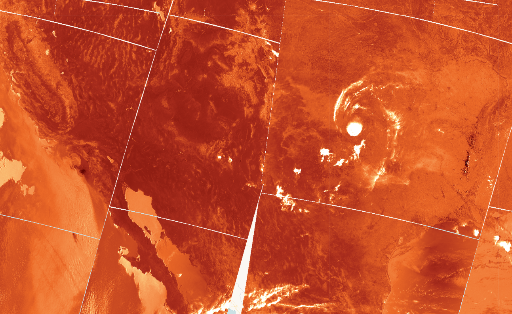

## General description

The script for Sentinel-3 SLSTR visualized a brightness temperature band F1 in red to blue color scheme. It can be used to monitor heat and detect wildfires. 

## Description of representative images

SLSTR F1 visualization of the US. Acquired on 2021-06-13, processed by Sentinel Hub. 

