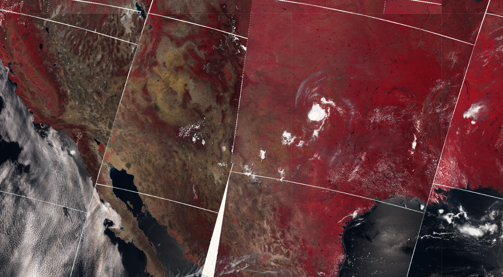

## General description

The script for Sentinel-3 SLSTR uses reflectance bands S3, S2 and S1 to return a false color composite, which generally visualizes vegetation in red, non-vegetated ground in brown colors, clouds in white and water in black. 

## Description of representative images

SLSTR false color composite of the US. Acquired on 2021-06-13, processed by Sentinel Hub. 

